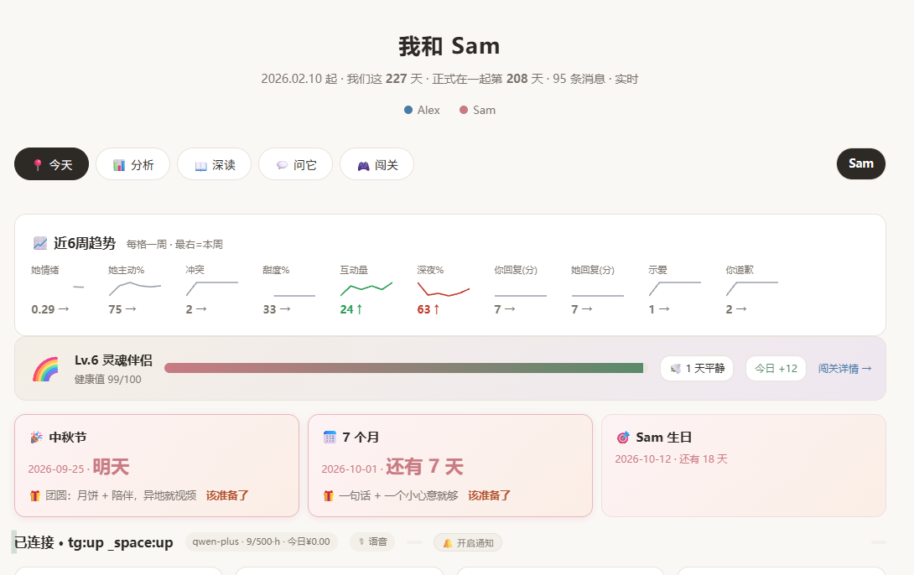
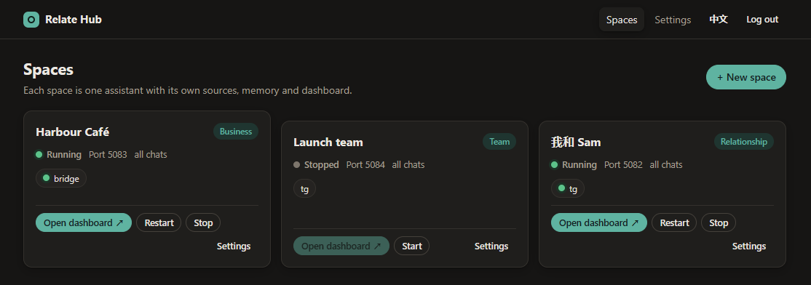
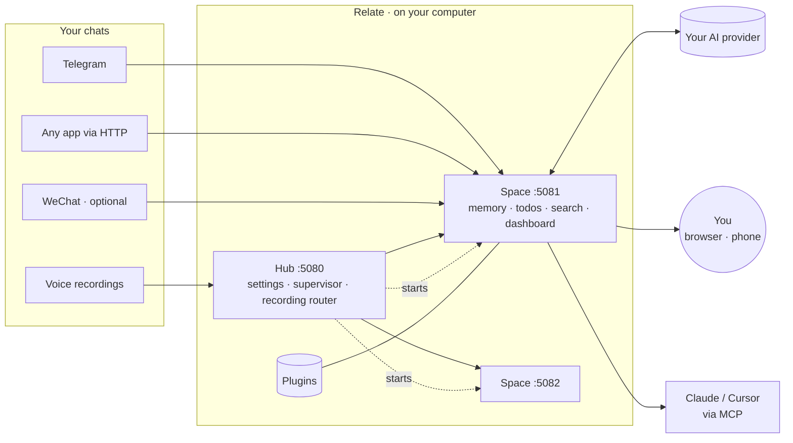

<div align="center">

# Relate

### Remember what she said. Keep what you promised.

Make her happier — and your own life easier.

<sub>A private AI chief of staff that runs on your own computer: it reads along with your chats, remembers your promises and the dates that matter.</sub>

[中文](README.md) · **English**

[Download for Windows](../../releases/latest) · [Quick start](#quick-start) · [Plugins](docs/PLUGINS.md) · [Docs](docs/PLATFORM.md)



</div>

## What it does

- 🟢 **Right now** — a short read on the conversation, refreshed within seconds when things heat up.
- ✅ **Todos that close themselves** — promises and unanswered questions are pulled out, ranked, and ticked off when done.
- 🧠 **A memory that doesn't drift** — needs, sensitive topics and open loops, re-checked against real messages daily.
- 💬 **Ask anything** — "what did we agree about Saturday?" — answered from the full history, with sources.
- ✍️ **Reply drafts** in your own voice, with a heads-up on what to avoid.
- 🔒 **You stay in control** — chats stay on your machine, and nothing is ever sent without your tap.

## Spaces

Each **space** is its own assistant — its own chats, memory and dashboard. Run as many as you like.

| | For | Keeps track of |
|---|---|---|
| 💞 **Relationship** | one important person | mood, needs, sensitive topics, promises, who owes a reply, festivals and anniversaries |
| 🏪 **Business** | customers, suppliers, staff groups | open loops, who's waiting on you, your commitments, blockers, each contact's mood |
| 👥 **Team** | a team or project | owners, decisions, unclaimed work, collaboration health |



## Quick start

### Windows

1. Download **`RelateSetup.exe`** from [Releases](../../releases/latest) and run it — no admin rights or Node.js needed.
2. Relate opens in your browser. Set a password.
3. **Settings → AI provider** → paste an API key → **Test**.
4. **New space** → pick a template → connect a chat app → **Start**.

Prefer no installer? Grab the **portable zip**, unzip anywhere, double-click `Relate.vbs`.
Your data lives in `%APPDATA%\Relate` and survives upgrades.

### macOS / Linux / from source

Needs [Node.js 22+](https://nodejs.org).

```bash
git clone https://github.com/georgeding/Relate && cd Relate
npm install
npm start            # → http://127.0.0.1:5080/hub/
```

## Connect your chats

| Source | Reads | Sends | Get started |
|---|:-:|:-:|---|
| **Telegram** | ✓ | ✓ | create a bot with [@BotFather](https://t.me/BotFather) ([guide](https://core.telegram.org/bots/tutorial)) and paste its token |
| **Any app** (WhatsApp, Slack, LINE, email…) | ✓ | ✓ | push messages over HTTP from a small bridge — [docs/INGEST.md](docs/INGEST.md) |
| **Voice recordings** ([Plaud](https://www.plaud.ai) and others) | ✓ | – | drop transcripts in a folder; each recording is routed to the right space |
| **WeChat** | ✓ | optional | two optional, Windows-only connectors — read [the risk notes](docs/CONNECTORS-AND-RISK.md) first |

> Relate contains no WeChat decryption, memory reading or code injection, and doesn't bundle third-party WeChat tools.

## Choose an AI

Any **OpenAI-compatible** API works. Pick one you trust:

| Provider | | Provider | |
|---|---|---|---|
| [Alibaba Model Studio (Qwen)](https://bailian.console.aliyun.com) | 🇨🇳 | [OpenAI](https://platform.openai.com) | 🌍 |
| [DeepSeek](https://platform.deepseek.com) | 🇨🇳 | [OpenRouter](https://openrouter.ai) (many models, one key) | 🌍 |
| [Zhipu GLM](https://open.bigmodel.cn) | 🇨🇳 | [Ollama](https://ollama.com) / [LM Studio](https://lmstudio.ai) | 💻 fully local |
| [Volcengine Doubao](https://www.volcengine.com/product/ark) | 🇨🇳 | | |

Relate batches its work, pauses when nobody's looking and caps calls per hour — a typical question costs a few
thousand tokens.

## Plugins

Switch built-ins on per space — relationship spaces start with the first two.

| Plugin | What it does |
|---|---|
| 🎑 **Festivals & anniversaries** | Spring Festival, Qixi, Mid-Autumn (lunar dates computed for any year), 520, Valentine's… plus day 100 / 520 / 1000, anniversaries and birthdays — with a push a few days ahead |
| ⏰ **Reply nudge** | a push when someone has waited too long for your reply |
| 🔔 **Keyword alert** | flags messages that mention words you watch |
| 🗓️ **Shift roster** | "who's on shift?" from a published [Google Sheet](https://support.google.com/docs/answer/183965) or any CSV |
| 🗄️ **Read-only SQL** | answers number questions from your Postgres, read-only |

Want something else? Describe it and the AI writes the plugin for you. → [Writing plugins](docs/PLUGINS.md)

## Use it from Claude, Cursor & co. (MCP)

Every space is an [MCP server](https://modelcontextprotocol.io), so AI tools can read your chats and board
(read-only). Copy the token from **Space → Access**, then e.g. in [Claude Code](https://docs.claude.com/en/docs/claude-code/mcp):

```bash
claude mcp add --transport http relate http://127.0.0.1:5081/mcp --header "Authorization: Bearer <token>"
```

## On your phone

Save the dashboard to your home screen and it works like an app — with push for reply reminders, festivals and
messages that need care. Reach it securely with [Tailscale](https://tailscale.com), a
[Cloudflare Tunnel](https://developers.cloudflare.com/cloudflare-one/connections/connect-networks/) or your own DDNS.

📱 **[Step-by-step phone guide](docs/PHONE.en.md)** — iPhone and Android, about 10 minutes.

## Privacy & security

- 🏠 **Local-first** — messages, memory and settings never leave your computer, except the text sent to your AI provider.
- 🔐 **Locked by default** — password-protected, listening on `127.0.0.1` only; secrets are never shown in the browser.
- ✋ **Human in the loop** — anything that acts on the outside world waits for your approval.
- 🧱 **Optional sandbox** — spaces can run with file access limited to their own folder and no child processes.

## How it works



One small hub, one process per space, plain Node.js, no build step. Each space keeps its own data folder, so
spaces never see each other's chats. More in [docs/PLATFORM.md](docs/PLATFORM.md).

## Development

```bash
npm test                  # unit + end-to-end: real hub and space processes, fake AI, fake WeFlow
node desktop/build.mjs    # Windows installer + portable zip → dist/  (needs Inno Setup 6)
```

Pushing a `v*` tag builds both downloads and publishes them to [Releases](../../releases).
Docs: [platform & APIs](docs/PLATFORM.md) · [plugins](docs/PLUGINS.md) · [bridging apps](docs/INGEST.md) ·
[connector risks](docs/CONNECTORS-AND-RISK.md)

## Thanks

Relate stands on these open-source projects: [Node.js](https://nodejs.org), the [MCP TypeScript SDK](https://github.com/modelcontextprotocol/typescript-sdk), [Chart.js](https://www.chartjs.org), [web-push](https://github.com/web-push-libs/web-push), [node-postgres](https://node-postgres.com) and [Zod](https://zod.dev). Thanks also to [@hicccc77](https://github.com/hicccc77) for their open-source work and inspiration. The Windows installer is built with [Inno Setup](https://jrsoftware.org/isinfo.php); its Simplified Chinese translation is by Zhenghan Yang.

## Friends

- [LINUX DO](https://linux.do) — a Chinese tech community

## License

[AGPL-3.0](LICENSE) — free to use, change and self-host. If you offer a modified version to others as a service,
share your changes under the same licence. Commercial licences are available from the copyright holder;
outside contributions need a contributor licence agreement (CLA).
