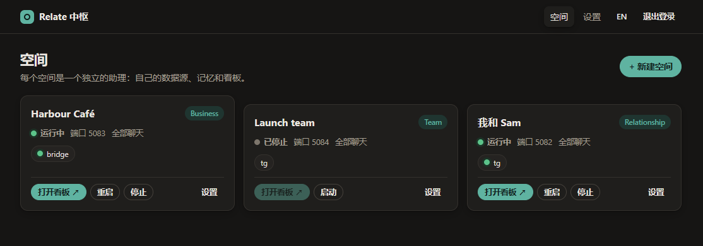
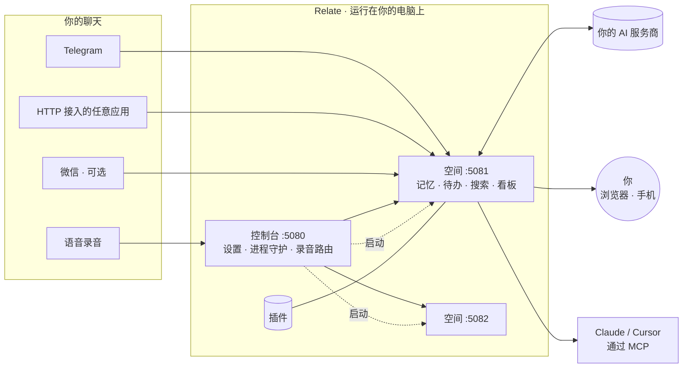

<div align="center">

# Relate

### 记得她说过的每一句话，也记得你答应过的每一件事。

让她更开心，你也更顺心。

<sub>一个跑在你自己电脑上的私人 AI 幕僚长：读懂聊天，记住承诺，提醒重要的日子。</sub>

**中文** · [English](README.en.md)

[下载 Windows 版](../../releases/latest) · [快速开始](#快速开始) · [插件](docs/PLUGINS.md) · [文档](docs/PLATFORM.md)


</div>

## 它能做什么

- 🟢 **实时速览** —— 一眼看懂当前聊天的走向，聊得火热时几秒内自动刷新。
- ✅ **自动闭环的待办** —— 承诺和没人回复的问题会被自动提取、排出优先级，办完自动打勾。
- 🧠 **不会跑偏的记忆** —— 记下需求、敏感话题和悬而未决的事，每天对照真实消息重新核对。
- 💬 **想问就问** —— “我们周六说好了什么来着？”—— 基于完整聊天记录作答，并附出处。
- ✍️ **用你的口吻代拟回复**，还会提醒哪些话别踩雷。
- 🔒 **主动权始终在你** —— 聊天记录只留在本机，不经你确认，一条消息也不会发出去。

## 空间

每个**空间**都是一个独立的助手——有自己的聊天、记忆和看板。想开多少个都行。

| | 适用对象 | 跟踪内容 |
|---|---|---|
| 💞 **亲密关系** | 某位重要的人 | 心情、需求、敏感话题、承诺、谁欠着回复、节日和纪念日 |
| 🏪 **生意** | 客户、供应商、员工群 | 未闭环的事项、谁在等你答复、你的承诺、阻碍点、每位联系人的心情 |
| 👥 **团队** | 某个团队或项目 | 负责人、决策、无人认领的工作、协作健康度 |



## 快速开始

### Windows

1. 从 [Releases](../../releases/latest) 下载 **`RelateSetup.exe`** 并运行——无需管理员权限，也不用装 Node.js。
2. Relate 会在浏览器中打开，设置一个密码即可。
3. **设置 → AI 服务商** → 粘贴 API 密钥 → **测试**。
4. **新建空间** → 挑一个模板 → 连接聊天应用 → **启动**。

不想用安装程序？下载**便携版 zip**，解压到任意位置，双击 `Relate.vbs` 即可。
你的数据保存在 `%APPDATA%\Relate`，升级也不会丢失。

### macOS / Linux / 从源码运行

需要 [Node.js 22+](https://nodejs.org)。

```bash
git clone https://github.com/georgeding/Relate && cd Relate
npm install
npm start            # → http://127.0.0.1:5080/hub/
```

## 接入你的聊天

| 来源 | 读取 | 发送 | 上手方式 |
|---|:-:|:-:|---|
| **Telegram** | ✓ | ✓ | 用 [@BotFather](https://t.me/BotFather) 创建一个机器人（[教程](https://core.telegram.org/bots/tutorial)），然后把 token 粘贴进来 |
| **任意应用**（WhatsApp、Slack、LINE、邮件……） | ✓ | ✓ | 通过一个小型桥接服务以 HTTP 推送消息 —— [docs/INGEST.md](docs/INGEST.md) |
| **语音录音**（[Plaud](https://www.plaud.ai) 等） | ✓ | – | 把转写文本放进一个文件夹即可；每条录音会自动路由到对应的空间 |
| **微信** | ✓ | 可选 | 两个可选的、仅限 Windows 的连接器 —— 请先阅读[风险说明](docs/CONNECTORS-AND-RISK.md) |

> Relate 不包含任何微信解密、内存读取或代码注入功能，也不捆绑任何第三方微信工具。

## 选择一个 AI

任何 **兼容 OpenAI** 的 API 都可以，选一个你信任的即可：

| 服务商 | | 服务商 | |
|---|---|---|---|
| [阿里云百炼（Qwen）](https://bailian.console.aliyun.com) | 🇨🇳 | [OpenAI](https://platform.openai.com) | 🌍 |
| [DeepSeek](https://platform.deepseek.com) | 🇨🇳 | [OpenRouter](https://openrouter.ai)（多模型，一个密钥） | 🌍 |
| [智谱 GLM](https://open.bigmodel.cn) | 🇨🇳 | [Ollama](https://ollama.com) / [LM Studio](https://lmstudio.ai) | 💻 完全本地运行 |
| [火山引擎豆包](https://www.volcengine.com/product/ark) | 🇨🇳 | | |

Relate 会把任务批量处理，无人使用时自动暂停，并限制每小时的调用次数——一个典型问题大约消耗几千 token。

## 插件

内置插件可按空间单独开启——亲密关系空间默认自带前两个。

| 插件 | 功能 |
|---|---|
| 🎑 **节日与纪念日** | 春节、七夕、中秋（任意年份的农历日期自动推算）、520、情人节……还有 100 / 520 / 1000 天、周年纪念日和生日——提前几天推送提醒 |
| ⏰ **回复提醒** | 对方等你的回复等太久时，推送提醒你 |
| 🔔 **关键词提醒** | 标记提到你关注关键词的消息 |
| 🗓️ **排班表** | 从已发布的 [Google 表格](https://support.google.com/docs/answer/183965) 或任意 CSV 中查“今天谁值班” |
| 🗄️ **只读 SQL** | 以只读方式查询你的 Postgres，回答数据类问题 |

还想要别的功能？描述一下需求，AI 帮你写插件。→ [编写插件](docs/PLUGINS.md)

## 在 Claude、Cursor 等工具中使用（MCP）

每个空间都是一个 [MCP 服务器](https://modelcontextprotocol.io)，因此 AI 工具可以读取你的聊天记录和看板（只读）。在 **空间 → 访问** 中复制 token，然后例如在 [Claude Code](https://docs.claude.com/en/docs/claude-code/mcp) 中这样配置：

```bash
claude mcp add --transport http relate http://127.0.0.1:5081/mcp --header "Authorization: Bearer <token>"
```

## 在手机上

把看板添加到手机主屏幕，用起来就像一个 App——回复提醒、节日纪念日、需要认真对待的消息都会推送给你。可以用 [Tailscale](https://tailscale.com)、[Cloudflare Tunnel](https://developers.cloudflare.com/cloudflare-one/connections/connect-networks/) 或自己的 DDNS 安全地访问。

📱 **[手机使用教程](docs/PHONE.md)** —— iPhone 和安卓都有，大约 10 分钟搞定。

## 隐私与安全

- 🏠 **本地优先** — 消息、记忆和设置永远不会离开你的电脑，发送给 AI 服务商的文本除外。
- 🔐 **默认上锁** — 有密码保护，仅监听 `127.0.0.1`；密钥绝不在浏览器中展示。
- ✋ **人工把关** — 任何作用于外部世界的操作，都要等你批准才会执行。
- 🧱 **可选沙盒** — 空间可在沙盒中运行，文件访问仅限自己的文件夹，且不允许启动子进程。

## 工作原理



一个小巧的控制台，一个空间一个进程，纯 Node.js 编写，无需构建。每个空间拥有独立的数据文件夹，因此空间之间彼此看不到对方的聊天记录。更多细节见 [docs/PLATFORM.md](docs/PLATFORM.md)。

## 开发

```bash
npm test                  # 单元 + 端到端测试：真实的控制台和空间进程、模拟 AI、模拟 WeFlow
node desktop/build.mjs    # 构建 Windows 安装包 + 便携版 → dist/（需要 Inno Setup 6）
```

推送 `v*` 标签即可自动构建安装包和便携版，并发布到 [Releases](../../releases)。
文档：[平台与 API](docs/PLATFORM.md) · [插件](docs/PLUGINS.md) · [桥接应用](docs/INGEST.md) ·
[连接器风险](docs/CONNECTORS-AND-RISK.md)

## 致谢

Relate 站在这些开源项目的肩膀上：[Node.js](https://nodejs.org)、[MCP TypeScript SDK](https://github.com/modelcontextprotocol/typescript-sdk)、[Chart.js](https://www.chartjs.org)、[web-push](https://github.com/web-push-libs/web-push)、[node-postgres](https://node-postgres.com)、[Zod](https://zod.dev)。Windows 安装包由 [Inno Setup](https://jrsoftware.org/isinfo.php) 构建，简体中文安装界面由 Zhenghan Yang 翻译。

## 友情链接

- [LINUX DO](https://linux.do) —— 新的理想型社区

## 许可证

[AGPL-3.0](LICENSE) —— 可自由使用、修改和自部署。如果你将修改后的版本以服务形式提供给他人，需在相同许可证下公开你的修改。商业许可证可向版权持有方获取；外部贡献需签署贡献者许可协议（CLA）。
